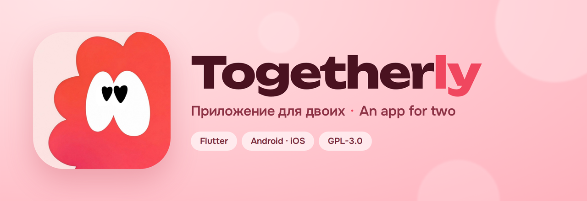
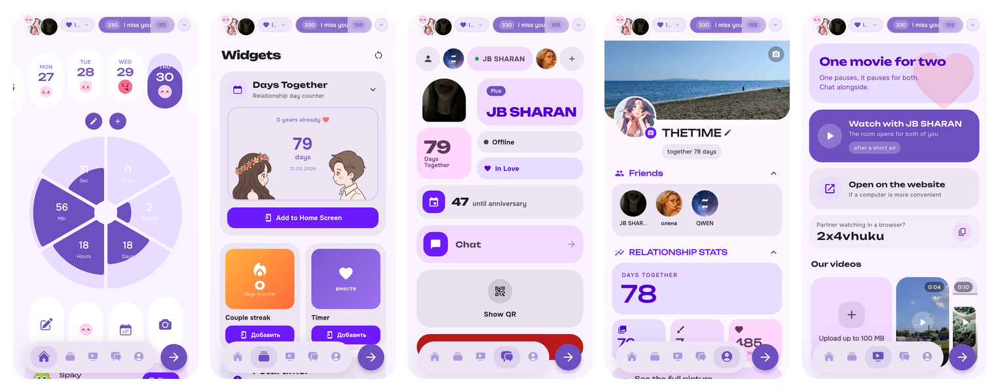

# Togetherly

 

**A cozy private space for two** — shared memories, moods, live map, home widgets, and little rituals that keep you close, even apart. 💛

🇷🇺 🇬🇧 · 2 languages

[**⬇ Download**](https://github.com/THET1ME-1/togetherly_app_releases/releases/latest) · [English](#english) · [Русский](#-togetherly-русский)

 

---

## English

**Togetherly** is a warm, private app for couples (and small close groups). One shared space where your relationship lives — memories, moods, and everyday closeness — whether you're together or miles apart.

### What's inside
- 📸 **Shared Memory Lane** — photos, videos, places, music, books & movies in one feed
- 💌 **Time capsule** — seal a letter or a photo; it opens on the day you choose
- 🔒 **Secret memories** — hide the special ones behind a PIN
- 🏆 **Couple achievements** — milestones (100 days together, first photo, …) with confetti
- 🗺️ **Live map "Where we are"** — see each other's location in real time
- 🧩 **Home-screen widgets** (Android & iOS) — shared photo, days together, streak, mood
- 😊 **Moods** — track your mood and see your partner's history
- ⏱️ **Days together, streaks**, anniversary & birthday reminders
- 💬 **Private chat** and "miss you" nudges with push notifications
- 🎨 **Shared drawing canvas** and postcards
- 🐣 **A couple mascot** that grows with your activity
- 🎨 **20 themes** (light & dark) and themed app icons
- 🪙 Coins & rewards, co-watch, and more

### Download
**Android** — [**GitHub Releases**](https://github.com/THET1ME-1/togetherly_app_releases/releases/latest) (recommended).

For auto-updates use **[Obtainium](https://github.com/ImranR98/Obtainium)**: *Add App* → paste
`https://github.com/THET1ME-1/togetherly_app_releases` → it tracks every new release (pick `arm64-v8a` — almost all modern phones).

One-tap: `obtainium://add/https://github.com/THET1ME-1/togetherly_app_releases`

Signing fingerprint (SHA-256) to verify the APK:
`1E:94:4F:00:FE:F1:17:D5:00:03:56:03:44:FC:BE:4F:9F:69:BF:FA:4C:F3:5B:A8:9F:26:D0:32:C3:3A:4E:13`

**RuStore · Google Play · App Store** — coming soon.

### Built with
Flutter (Material 3) · Dart · self-hosted **PocketBase** (auth / data / media) · **Centrifugo** (realtime) · offline-first sync · Android & iOS.

### Build & contribute
Togetherly is **open source under [GPL-3.0](LICENSE)**. To build it yourself or run your own backend, see **[CONTRIBUTING.md](CONTRIBUTING.md)**. Bug reports and pull requests are welcome; security issues → **[SECURITY.md](SECURITY.md)**.

> The author's project keys are not shipped. Config files ship as `*.example` templates — copy them and plug in your own (Firebase, PocketBase, provider tokens). See CONTRIBUTING for the full list.

*The app is free to use. Source © THET1ME-1, licensed under the GNU General Public License v3.0.*

---

## 🩷 Togetherly (Русский)

**Togetherly** — тёплое приватное приложение для пар (и небольших близких групп). Одно общее пространство, где живут ваши отношения: воспоминания, настроения и повседневная близость — вместе вы или за тысячи километров.

### Что внутри
- 📸 **Общая лента воспоминаний** — фото, видео, места, музыка, книги и фильмы в одной ленте
- 💌 **Капсула времени** — запечатайте письмо или фото; откроется в выбранный вами день
- 🔒 **Секретные воспоминания** — спрячьте особенное под PIN
- 🏆 **Достижения пары** — вехи (100 дней вместе, первое фото…) с праздничным салютом
- 🗺️ **Живая карта «Где мы»** — видите геопозицию друг друга в реальном времени
- 🧩 **Виджеты на экране** (Android и iOS) — общее фото, дни вместе, серия, настроение
- 😊 **Настроения** — отмечайте своё и смотрите историю партнёра
- ⏱️ **Дни вместе, серии**, напоминания о годовщине и дне рождения
- 💬 **Личный чат** и кнопка «Я скучаю» с пуш-уведомлениями
- 🎨 **Общий холст для рисования** и открытки
- 🐣 **Маскот пары**, который растёт вместе с вами
- 🎨 **20 тем** (светлые и тёмные) и тематические иконки приложения
- 🪙 Коины и награды, совместный просмотр и не только

### Скачать
**Android** — [**GitHub Releases**](https://github.com/THET1ME-1/togetherly_app_releases/releases/latest) (рекомендуется).

Для авто-обновлений используйте **[Obtainium](https://github.com/ImranR98/Obtainium)**: *Add App* → вставьте
`https://github.com/THET1ME-1/togetherly_app_releases` → он подхватывает каждый новый релиз (выбирайте `arm64-v8a` — почти все современные телефоны).

One-tap: `obtainium://add/https://github.com/THET1ME-1/togetherly_app_releases`

Отпечаток подписи (SHA-256) для проверки APK:
`1E:94:4F:00:FE:F1:17:D5:00:03:56:03:44:FC:BE:4F:9F:69:BF:FA:4C:F3:5B:A8:9F:26:D0:32:C3:3A:4E:13`

**RuStore · Google Play · App Store** — скоро.

### На чём сделано
Flutter (Material 3) · Dart · самохост **PocketBase** (авторизация / данные / медиа) · **Centrifugo** (realtime) · offline-first синхронизация · Android и iOS.

### Сборка и вклад
Togetherly — **открытый код под [GPL-3.0](LICENSE)**. Как собрать самому или поднять свой бэкенд — см. **[CONTRIBUTING.md](CONTRIBUTING.md)**. Баг-репорты и pull request'ы приветствуются; про уязвимости — **[SECURITY.md](SECURITY.md)**.

> Ключи проекта автора в репозитории не лежат. Конфиги идут как `*.example`-шаблоны — скопируйте и подставьте свои (Firebase, PocketBase, токены провайдеров). Полный список — в CONTRIBUTING.

*Приложение бесплатное. Исходники © THET1ME-1, под лицензией GNU General Public License v3.0.*

---

Made with Flutter & 💛 · <code>com.togetherly.love</code>

